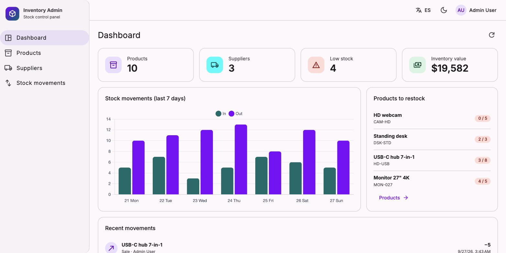

# Angular Admin

[](https://github.com/MigueIAngel/angular-admin/actions/workflows/ci.yml)


An inventory admin panel built with **Angular 22** and **Angular Material**. It is the frontend of [nest-inventory-api](https://github.com/MigueIAngel/nest-inventory-api): dashboard, products, suppliers and stock movements, with role-aware UI, a Spanish/English UI and dark mode.



## Features

- **Modern Angular**: standalone components, zoneless change detection, signals (`signal`, `computed`, `linkedSignal`), the new control flow (`@if`, `@for`) and `httpResource` for declarative data fetching
- **Authentication**: JWT login, a signal-based `AuthService`, a functional HTTP interceptor and route guards
- **Role-aware UI**: create, edit and delete actions are only shown to admins
- **Dashboard**: KPI cards, a Chart.js bar chart of the last 7 days, low-stock alerts and recent movements
- **Products and suppliers**: server-side pagination, sorting, debounced search, filters and CRUD dialogs with reactive form validation
- **Stock movements**: history with a type filter and a register dialog that shows available stock
- **i18n**: Spanish and English with `ngx-translate`, locale-aware dates and currency, and the language choice persisted
- **Dark mode**: Material 3 theme with a persisted light/dark toggle
- **Responsive**: the side navigation collapses into a drawer on small screens
- **Tests and CI**: Vitest unit tests, a Prettier check and a production build on every push

## Tech stack

| Area | Tools |
|---|---|
| Framework | Angular 22 (standalone, zoneless, signals) |
| UI | Angular Material 3, CDK, Chart.js |
| i18n | ngx-translate (HTTP loader) |
| Testing | Vitest, Angular TestBed, HttpTestingController |
| Tooling | Angular CLI, Prettier, GitHub Actions, Docker + nginx |

## Getting started

The panel needs the API running. The quickest way to start it:

```bash
git clone https://github.com/MigueIAngel/nest-inventory-api
cd nest-inventory-api && docker compose up --build   # API on http://localhost:3000
```

Then start the panel (Node 24, see `.nvmrc`):

```bash
npm install
npm start          # http://localhost:4200
```

Log in with one of the demo accounts. The login page has one-click buttons for them:

| Email | Password | Role |
|---|---|---|
| `admin@inventory.dev` | `admin123` | admin |
| `staff@inventory.dev` | `staff123` | staff |

The API URL is configured in `src/environments/environment.ts`.

### Scripts

```bash
npm test               # unit tests (Vitest)
npm run build          # production build
npm run format:check   # Prettier
docker build -t angular-admin . && docker run -p 8080:80 angular-admin
```

## Project structure

```
src/app/
├── core/
│   ├── api/           # write operations + query param helper
│   ├── auth/          # AuthService (signals), interceptor, guards
│   ├── i18n/          # LanguageService (ES/EN)
│   ├── models.ts      # API types
│   └── theme.service.ts
├── layout/            # Shell: sidenav, toolbar, user menu
├── shared/            # Chart, confirm dialog, notifier
└── features/
    ├── login/
    ├── dashboard/
    ├── products/
    ├── suppliers/
    └── movements/
public/i18n/           # en.json, es.json
```

## License

MIT
